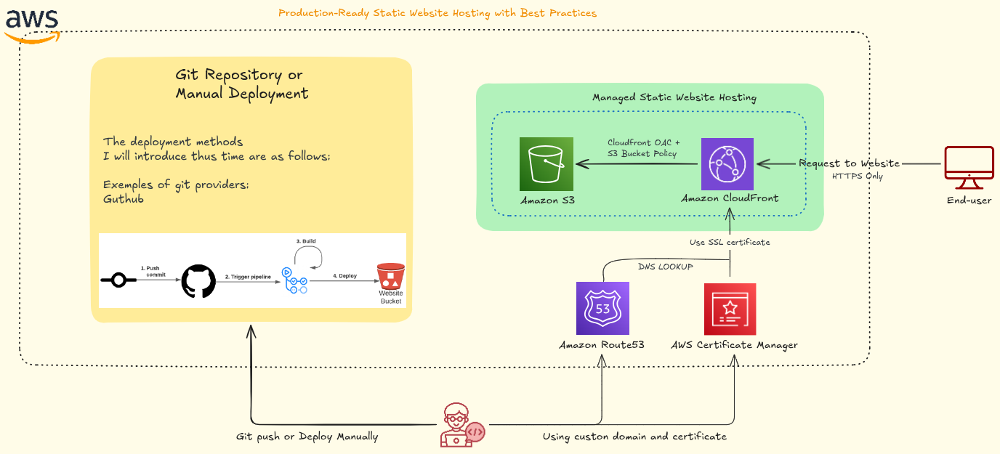

<div align="center">
  


# Hospedagem de Site Estático Pronto para Produção com Melhores Práticas

**Atualizado: 14 de Janeiro de 2026**

[](https://github.com/nicoleepaixao)
[](https://github.com/nicoleepaixao/aws-s3-cloudfront-static-site)
[](https://nicoleepaixao.medium.com/)

<p align="center">
  <a href="README-PT.md">🇧🇷</a>
  <a href="README.md">🇺🇸</a>
</p>

</div>

---

<p align="center">
  
</p>

## **Visão Geral**

Este projeto demonstra como hospedar um site estático (HTML/CSS/JS, SPA ou site simples) na AWS seguindo as melhores práticas atuais. A solução usa um **bucket S3 privado** com distribuição CloudFront, Origin Access Control (OAC), DNS Route 53, certificados TLS gerenciados pelo ACM e deployment automatizado CI/CD com invalidação de cache.

---

## **Informações Importantes**

### **Componentes da Arquitetura**

| **Componente** | **Propósito** |
|---------------|-------------|
| **Bucket S3** | Armazenamento privado para assets estáticos (Block Public Access habilitado) |
| **CloudFront** | CDN global com HTTPS, caching e compressão |
| **Origin Access Control (OAC)** | Restringe acesso S3 apenas ao CloudFront |
| **Route 53** | Gerenciamento DNS apontando para CloudFront |
| **ACM** | Gerenciamento de certificado TLS (us-east-1) |
| **GitHub Actions** | Deployment automatizado com sync S3 e invalidação |

### **Por Que Isso Importa**

Erros comuns na hospedagem de sites estáticos:

- **Buckets S3 públicos**: Risco de segurança e violações de compliance
- **Hospedagem direta de site S3**: Sem CDN, sem aplicação HTTPS
- **OAC/OAI faltando**: Bucket acessível sem CloudFront
- **Sem versionamento**: Não pode fazer rollback de deployments ruins
- **Deployments manuais**: Propenso a erros e demorado

### **Benefícios da Solução**

✅ **Zero Exposição Pública**: Bucket permanece completamente privado  
✅ **Performance Global**: Localizações edge CloudFront mundialmente  
✅ **HTTPS Automático**: Certificados gerenciados ACM com auto-renovação  
✅ **Suporte SPA**: Respostas de erro customizadas para roteamento client-side  
✅ **Deployments Automatizados**: GitHub Actions com invalidação de cache  
✅ **Auditabilidade**: Logging e monitoramento centralizados  
✅ **Custo Eficiente**: Pague apenas por armazenamento e transferência de dados

---

## **Arquitetura**

### **Fluxo de Alto Nível**

<p align="center">
  
</p>

</div>

### **Princípios Chave de Segurança**

- **Privado por Padrão**: Bucket S3 nunca exposto publicamente
- **HTTPS Everywhere**: CloudFront força redirecionamento HTTPS
- **Acesso Restrito**: OAC garante que apenas CloudFront leia do S3
- **Criptografia**: Dados em repouso (S3) e em trânsito (TLS 1.2+)
- **Logging**: Logs de acesso CloudFront para trilha de auditoria

---

## **Pré-requisitos**

### **Requisitos da Conta AWS**

| **Serviço** | **Permissões Necessárias** |
|-------------|-------------------------|
| **S3** | CreateBucket, PutObject, GetObject, PutBucketPolicy |
| **CloudFront** | CreateDistribution, UpdateDistribution, CreateInvalidation |
| **ACM** | RequestCertificate, DescribeCertificate |
| **Route 53** | ChangeResourceRecordSets, ListHostedZones |

### **Ambiente de Desenvolvimento**

- AWS CLI configurado (`aws configure` ou SSO)
- Git / conta GitHub
- Node.js (para processo de build)
- Nome de domínio (gerenciado no Route 53)

---

## **Setup Passo a Passo**

## **Passo 1: Criar Bucket S3**

### **Configuração do Bucket**

```bash
export BUCKET_NAME=nicloud-static-site-prod
export REGION=us-east-1
```

**Via Console AWS:**

1. Navegue até S3 → Create bucket
2. **Nome do bucket**: `nicloud-static-site-prod`
3. **Região**: Escolha sua região primária (ex.: us-east-1)
4. **Object Ownership**: Bucket owner enforced
5. **Block Public Access**: ✅ Habilitar todas as opções
6. **Bucket Versioning**: ✅ Habilitar
7. **Default Encryption**: SSE-S3 (ou SSE-KMS)
8. Clique em Create bucket

**Via AWS CLI:**

```bash
# Criar bucket (us-east-1)
aws s3api create-bucket \
  --bucket $BUCKET_NAME \
  --region $REGION

# Para outras regiões
aws s3api create-bucket \
  --bucket $BUCKET_NAME \
  --region $REGION \
  --create-bucket-configuration LocationConstraint=$REGION

# Habilitar Block Public Access
aws s3api put-public-access-block \
  --bucket $BUCKET_NAME \
  --public-access-block-configuration '{
    "BlockPublicAcls": true,
    "IgnorePublicAcls": true,
    "BlockPublicPolicy": true,
    "RestrictPublicBuckets": true
  }'

# Habilitar versionamento
aws s3api put-bucket-versioning \
  --bucket $BUCKET_NAME \
  --versioning-configuration Status=Enabled

# Habilitar criptografia
aws s3api put-bucket-encryption \
  --bucket $BUCKET_NAME \
  --server-side-encryption-configuration '{
    "Rules": [{
      "ApplyServerSideEncryptionByDefault": {
        "SSEAlgorithm": "AES256"
      }
    }]
  }'
```

---

## **Passo 2: Upload de Conteúdo Inicial**

### **Estrutura do Projeto**

```text
project-root/
  ├── src/                    # Código fonte (React, Vue, etc.)
  ├── build/                  # Saída do build (gerada)
  │   ├── index.html
  │   ├── assets/
  │   │   ├── css/
  │   │   ├── js/
  │   │   └── images/
  │   └── favicon.ico
  └── ...
```

### **Upload para S3**

**Via Console:**
1. Navegue até bucket → Upload
2. Upload todo conteúdo da pasta `build/`
3. Garanta que `index.html` está na raiz do bucket

**Via CLI:**

```bash
aws s3 sync ./build s3://$BUCKET_NAME --delete
```

---

## **Passo 3: Solicitar Certificado ACM**

**Importante:** CloudFront requer certificados na região **us-east-1**.

### **Via Console:**

1. Navegue até ACM → Request certificate
2. Mude região para **N. Virginia (us-east-1)**
3. Tipo de certificado: Request a public certificate
4. Nomes de domínio:
   - `www.seusite.com`
   - (Opcional) `seusite.com`
5. Método de validação: DNS validation
6. Clique em **Request**

### **Validação DNS:**

1. Clique em **Create records in Route 53** (se domínio estiver no Route 53)
2. Aguarde status: **Issued**
3. Salve o ARN do certificado

**Via CLI:**

```bash
aws acm request-certificate \
  --domain-name www.seusite.com \
  --validation-method DNS \
  --region us-east-1
```

---

## **Passo 4: Criar Distribuição CloudFront**

### **4.1 Criar Origin Access Control (OAC)**

**Via Console:**

1. CloudFront → Security → Origin access
2. Clique em **Create origin access control**
3. Nome: `oac-s3-static-site`
4. Comportamento de assinatura: Sign requests (recomendado)
5. Clique em **Create**

### **4.2 Criar Distribuição**

**Via Console:**

1. CloudFront → Create distribution

**Configurações de Origem:**
- **Origin domain**: Selecione bucket S3 `nicloud-static-site-prod`
- **Origin access**: Origin access control
- **OAC**: Selecione `oac-s3-static-site`

**Comportamento de Cache Padrão:**
- **Viewer protocol policy**: Redirect HTTP to HTTPS
- **Allowed HTTP methods**: GET, HEAD
- **Cache policy**: CachingOptimized (recomendado)
- **Compress objects automatically**: Yes

**Configurações:**
- **Price class**: Use only North America and Europe (ou todas localizações)
- **Alternate domain name (CNAME)**: `www.seusite.com`
- **Custom SSL certificate**: Selecione certificado ACM
- **Default root object**: `index.html`

**Logging (Recomendado):**
- **Standard logging**: On
- **S3 bucket**: `nicloud-cloudfront-logs`
- **Log prefix**: `prod/`

2. Clique em **Create distribution**
3. Salve **Distribution ID** e **Domain name** (ex.: `d123456abcdef.cloudfront.net`)

---

## **Passo 5: Configurar Política do Bucket S3**

### **Atualizar Política do Bucket para OAC**

Copie a política do console CloudFront ou use este template:

```json
{
  "Version": "2012-10-17",
  "Statement": [
    {
      "Sid": "AllowCloudFrontOACReadOnly",
      "Effect": "Allow",
      "Principal": {
        "Service": "cloudfront.amazonaws.com"
      },
      "Action": "s3:GetObject",
      "Resource": "arn:aws:s3:::nicloud-static-site-prod/*",
      "Condition": {
        "StringEquals": {
          "AWS:SourceArn": "arn:aws:cloudfront::123456789012:distribution/ABCDEFG1234567"
        }
      }
    }
  ]
}
```

**Substituir:**
- `nicloud-static-site-prod` com nome do seu bucket
- `arn:aws:cloudfront::123456789012:distribution/ABCDEFG1234567` com ARN da sua distribuição

**Aplicar Política:**

1. Navegue até S3 → Bucket → Permissions → Bucket policy
2. Cole a política
3. Clique em **Save changes**

**Via CLI:**

```bash
aws s3api put-bucket-policy \
  --bucket $BUCKET_NAME \
  --policy file://bucket-policy.json
```

---

## **Passo 6: Configurar DNS Route 53**

### **Criar Registro DNS**

1. Navegue até Route 53 → Hosted zones
2. Selecione sua zona de domínio (ex.: `seusite.com`)
3. Clique em **Create record**

**Configuração do Registro:**
- **Record name**: `www`
- **Record type**: A
- **Alias**: ✅ Yes
- **Route traffic to**: CloudFront distribution
- **Distribution**: Selecione sua distribuição

4. Clique em **Create records**

### **Opcional: Redirecionar Domínio Raiz**

Para redirecionar `seusite.com` → `www.seusite.com`, crie outra distribuição CloudFront ou use redirecionamento S3.

---

## **Passo 7: Configuração SPA (React, Vue, Angular)**

Para Single Page Applications com roteamento client-side:

### **Respostas de Erro Customizadas**

1. CloudFront → Distribution → Error pages
2. Adicione respostas de erro customizadas:

**Para Erros 403:**
- **HTTP error code**: 403
- **Response page path**: `/index.html`
- **HTTP response code**: 200
- **TTL**: 10 segundos

**Para Erros 404:**
- **HTTP error code**: 404
- **Response page path**: `/index.html`
- **HTTP response code**: 200
- **TTL**: 10 segundos

Isso garante que deep links como `/dashboard` funcionem corretamente.

---

## **Pipeline CI/CD (GitHub Actions)**

### **Estrutura do Projeto**

```text
aws-s3-cloudfront-static-site/
  ├── src/
  ├── build/                  # Gerado (não commitado)
  ├── .github/
  │   └── workflows/
  │       └── deploy.yml
  ├── README.md
  └── package.json
```

### **Workflow GitHub Actions**

**Arquivo:** `.github/workflows/deploy.yml`

```yaml
name: Deploy Static Site to S3 + CloudFront

on:
  push:
    branches: [ main ]

jobs:
  deploy:
    runs-on: ubuntu-latest

    env:
      AWS_REGION: us-east-1
      S3_BUCKET: nicloud-static-site-prod
      CLOUDFRONT_DISTRIBUTION_ID: ABCDEFG1234567

    steps:
      - name: Checkout repository
        uses: actions/checkout@v4

      - name: Setup Node.js
        uses: actions/setup-node@v4
        with:
          node-version: '20'

      - name: Install dependencies
        run: npm install

      - name: Build project
        run: npm run build

      - name: Configure AWS credentials
        uses: aws-actions/configure-aws-credentials@v4
        with:
          aws-access-key-id: ${{ secrets.AWS_ACCESS_KEY_ID }}
          aws-secret-access-key: ${{ secrets.AWS_SECRET_ACCESS_KEY }}
          aws-region: ${{ env.AWS_REGION }}

      - name: Sync build folder to S3
        run: |
          aws s3 sync ./build s3://$S3_BUCKET --delete

      - name: Invalidate CloudFront cache
        run: |
          aws cloudfront create-invalidation \
            --distribution-id $CLOUDFRONT_DISTRIBUTION_ID \
            --paths "/*"
```

### **Configuração de Secrets GitHub**

Adicione esses secrets ao seu repositório:
- `AWS_ACCESS_KEY_ID`
- `AWS_SECRET_ACCESS_KEY`

**Para OIDC (Melhor Segurança):** Substitua chaves estáticas por AssumeRole.

---

## **Logging e Observabilidade**

### **Logs de Acesso CloudFront**

**Setup:**

1. Crie bucket de log dedicado: `nicloud-cloudfront-logs`
2. CloudFront → Distribution → Edit → Logging
3. Habilite **Standard logging**
4. Bucket S3: `nicloud-cloudfront-logs`
5. Prefixo de log: `prod/`

**Opções de Análise:**
- **Amazon Athena**: Consultar logs com SQL
- **CloudWatch Insights**: Monitoramento em tempo real
- **Ferramentas terceiras**: Splunk, ELK Stack

### **Métricas Chave para Monitorar**

| **Métrica** | **Limite** | **Alerta** |
|------------|---------------|-----------|
| Taxa de Erro 4xx | > 5% | Aviso |
| Taxa de Erro 5xx | > 1% | Crítico |
| Taxa de Acerto Cache | < 80% | Investigação |
| Latência | > 500ms | Aviso |

---

## **Opcional: Integração AWS WAF**

Para ambientes de produção, adicione Web Application Firewall:

### **Setup WAF**

1. Navegue até AWS WAF → Web ACLs
2. Crie web ACL
3. Adicione regras gerenciadas:
   - **Core rule set** (CommonRuleSet)
   - **Known bad inputs**
   - **SQL injection**
   - **Cross-site scripting (XSS)**
   - **IP reputation**
   - **Rate limiting**

4. Associe com distribuição CloudFront

**Benefícios:**
- Proteção contra OWASP Top 10
- Mitigação DDoS
- Gerenciamento de bots
- Bloqueio geográfico

---

## **Checklist de Produção**

| **Item** | **Status** |
|----------|-----------|
| ✅ Bucket S3 criado com Block Public Access habilitado | ☐ |
| ✅ Versionamento de bucket habilitado | ☐ |
| ✅ Criptografia padrão configurada (SSE-S3 ou KMS) | ☐ |
| ✅ Conteúdo inicial carregado (index.html + assets) | ☐ |
| ✅ Certificado ACM solicitado e validado (us-east-1) | ☐ |
| ✅ Distribuição CloudFront criada com OAC | ☐ |
| ✅ HTTPS forçado (Redirect HTTP to HTTPS) | ☐ |
| ✅ Domínio customizado configurado (CNAME) | ☐ |
| ✅ Política bucket S3 restringe acesso ao ARN CloudFront | ☐ |
| ✅ Registro A Route 53 (Alias) apontando para CloudFront | ☐ |
| ✅ Tratamento de erro SPA configurado (403/404 → index.html) | ☐ |
| ✅ Logging CloudFront habilitado | ☐ |
| ✅ Pipeline CI/CD configurado (GitHub Actions) | ☐ |
| ✅ WAF associado (opcional mas recomendado) | ☐ |

---

## **Funcionalidades**

| **Funcionalidade** | **Descrição** |
|-------------|-----------------|
| **Bucket S3 Privado** | Sem acesso público, Block Public Access forçado |
| **CDN Global** | Localizações edge CloudFront mundialmente |
| **Apenas HTTPS** | TLS 1.2+ com certificados gerenciados ACM |
| **Origin Access Control** | OAC moderno substitui OAI legado |
| **Deployments Automatizados** | GitHub Actions com sync S3 e invalidação |
| **Suporte SPA** | Respostas de erro customizadas para roteamento client-side |
| **Versionamento** | Capacidade de rollback para deployments ruins |
| **Logging** | Logs de acesso CloudFront para trilha de auditoria |
| **Custo Otimizado** | Pague apenas por armazenamento e transferência de dados |

---

## **Tecnologias Utilizadas**

| **Tecnologia** | **Propósito** |
|----------------|-------------|
| Amazon S3 | Armazenamento de arquivos estáticos |
| Amazon CloudFront | Rede de entrega de conteúdo global |
| AWS Certificate Manager | Gerenciamento de certificado TLS |
| Amazon Route 53 | Gerenciamento DNS |
| AWS WAF | Web application firewall (opcional) |
| GitHub Actions | Automação CI/CD |

---

## **Estrutura do Projeto**

```text
aws-s3-cloudfront-static-site/
│
├── README.md                      # Documentação completa
│
├── src/                           # Código fonte
│
├── build/                         # Saída do build (não commitado)
│
├── .github/
│   └── workflows/
│       └── deploy.yml             # Workflow GitHub Actions
│
├── policies/
│   └── bucket-policy.json         # Template de política bucket S3
│
└── package.json                   # Dependências Node.js
```

---

## **Informações Adicionais**

Para mais detalhes sobre AWS CloudFront, S3 e hospedagem de site estático, consulte:

- [CloudFront Best Practices](https://docs.aws.amazon.com/AmazonCloudFront/latest/DeveloperGuide/best-practices.html) - Guia oficial
- [S3 Static Website Hosting](https://docs.aws.amazon.com/AmazonS3/latest/userguide/WebsiteHosting.html) - Documentação S3
- [Origin Access Control](https://docs.aws.amazon.com/AmazonCloudFront/latest/DeveloperGuide/private-content-restricting-access-to-s3.html) - Setup OAC
- [ACM Certificate Validation](https://docs.aws.amazon.com/acm/latest/userguide/dns-validation.html) - Validação DNS

---

## **Conecte-se & Siga**

Mantenha-se atualizado com melhores práticas AWS e arquiteturas web modernas:

<div align="center">

[](https://github.com/nicoleepaixao)
[](https://www.linkedin.com/in/nicolepaixao/)
[](https://medium.com/@nicoleepaixao)

</div>

---

## **Aviso Legal**

Esta implementação segue melhores práticas AWS de 2 de Dezembro de 2025. Recursos de serviços AWS, preços e recomendações podem evoluir. Sempre teste configurações em ambientes de não-produção antes de implantar em produção. Garanta compliance com políticas de segurança da sua organização e requisitos regulatórios. Consulte documentação oficial da AWS para informações mais atuais.

---

<div align="center">

**Construa aplicações web modernas com confiança!**

*Documento Criado: 2 de Janeiro de 2026*

Made with ❤️ by [Nicole Paixão](https://github.com/nicoleepaixao)

</div>
